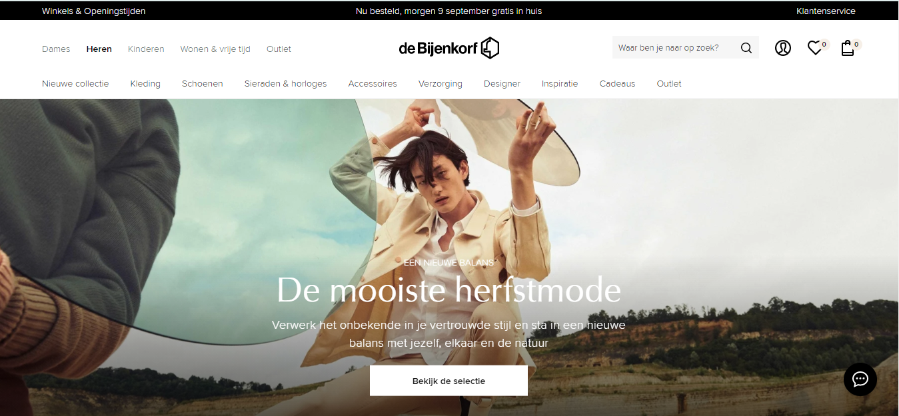
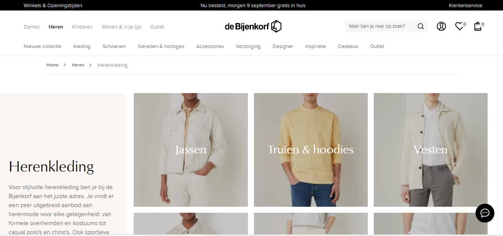
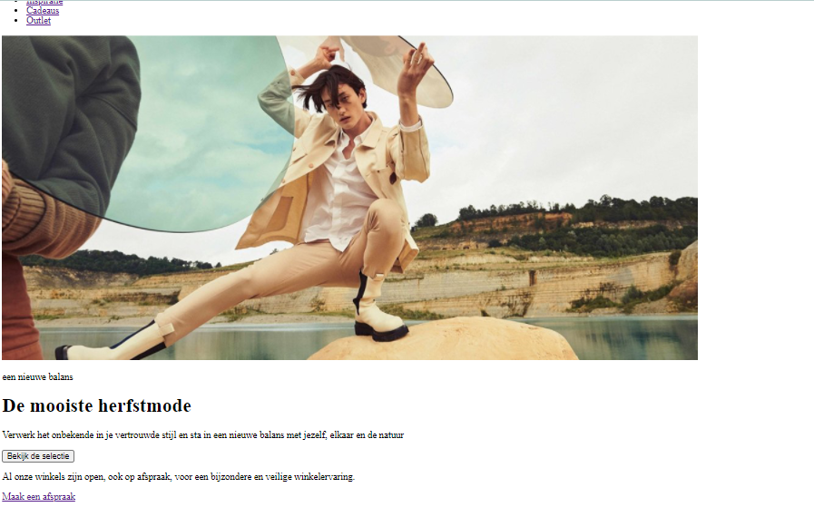
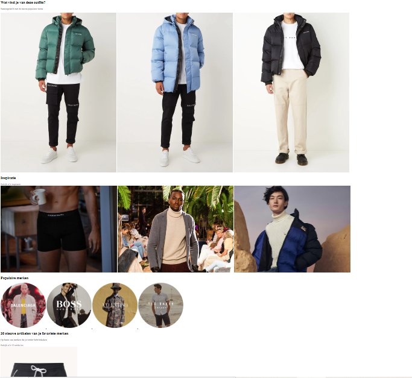
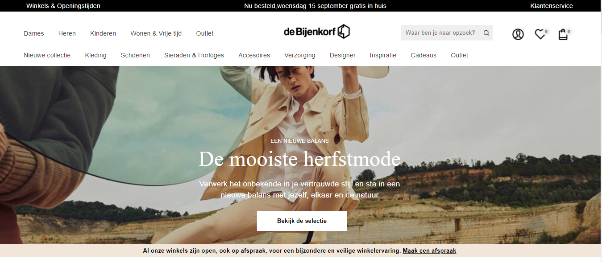
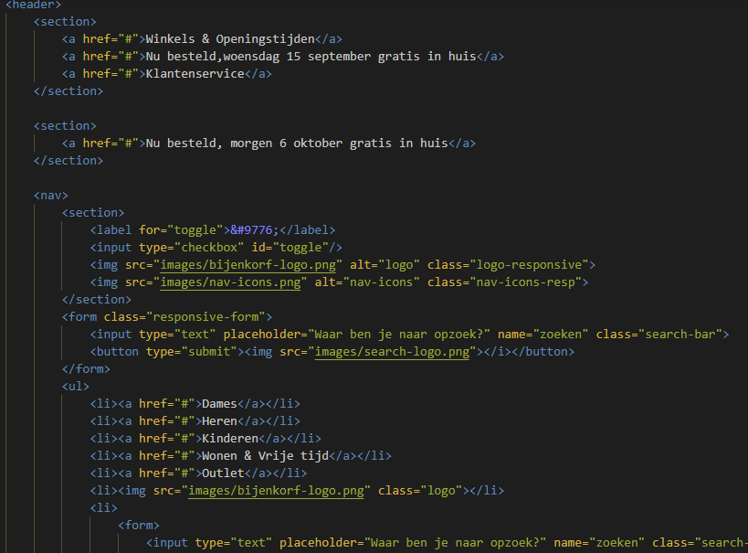
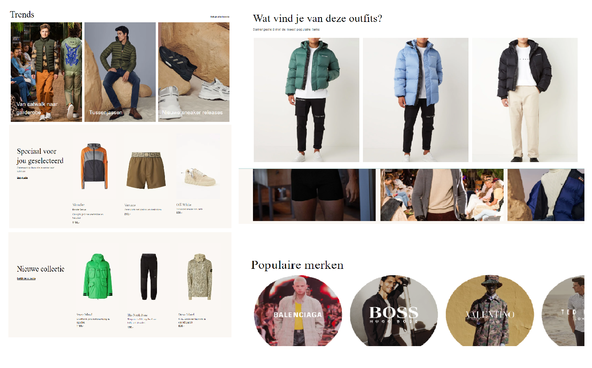
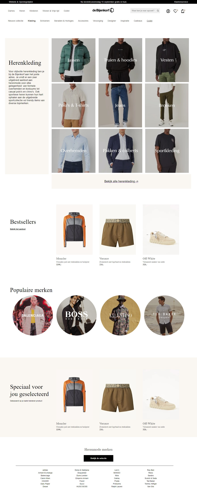

# Procesverslag
Markdown is een simpele manier om HTML te schrijven.  
Markdown cheat cheet: [Hulp bij het schrijven van Markdown](https://github.com/adam-p/markdown-here/wiki/Markdown-Cheatsheet).

Nb. De standaardstructuur en de spartaanse opmaak van de README.md zijn helemaal prima. Het gaat om de inhoud van je procesverslag. Besteedt de tijd voor pracht en praal aan je website.

Nb. Door *open* toe te voegen aan een *details* element kun je deze standaard open zetten. Fijn om dat steeds voor de relevante stuk(ken) te doen.

## Jij

uitwerken voor kick-off werkgroep

### Auteur:
Adil el Bardai

#### Je startniveau:
rood

#### Je focus:
Voorheen was het "responsive" maar ik heb voor de herkansing toch gekozen voor "surface". 

## Je website

uitwerken voor kick-off werkgroep

### Je opdracht:
De bijenkorf: https://www.debijenkorf.nl

#### Screenshot(s) van de eerste pagina (small screen): 
home pagina

#### Screenshot(s) van de tweede pagina (small screen):
Heren kleding 

 

## Breakdownschets (week 1)

uitwerken na afloop 2e werkgroep

### Content plaatsen: 
Ik heb wat content op de website geplaatst, maar zonder styling. Eerst alle elementen neergezet die ik nodig
had en later beginnen aan de styling, zo is dit wat makkelijker werken.

### Knoppen plaatsen: 
Naast het plaatsen van de content heb ik knoppen toegevoegd en geprobeerd te positioneren.

## Voortgang 1 (week 2)

uitwerken voor 1e voortgang

### Stand van zaken
Het maken van van de content en knoppen ging goed. Ik kwam niet echt tegen dingen aan waardoor ik moeite had.

### Extra content toevoegen: 
Ik heb iets meer content op de pagina gevoegd dan dat ik al had. Doordat de website van de bijenkorf veel
content bevat, doe ik dit allemaal in delen.

## Voortgang 2 (week 3)

uitwerken voor 2e voortgang

### Stand van zaken
Hier ben ik begonnen met het stylen van de eerste gedeelte van de content

### Eerste gedeelte content stylen: 
Hier heb ik wat meer content op de pagina toegevoegd

### Eerste gedeelte content stylen: 
in het begin had ik een klein beetje moeite om alles te positioneren zonder classes, maar uiteinlijk ik het eerste gedeelte van de code in verschillende tags gestopt. Hierdoor werd het een stuk makkelijker.

## Toegankelijkheidstest (week 4)

uitwerken na test in 8e voortgang

### Bevindingen
Lijst met bevindingen tijdens de test:
-Navigeert/tabt door de website zonder problemen
-Alle buttons en a links zijn klikbaar
-De alt tags van images komen duidelijk naar voren
-De headings zijn leesbaar tijdens de test
#### Titel eerste bevinding
Tabben

Als een gebruiker op de pagina komt is het mogelijk om op tab te klikken op de toetsenbord om zo door de gehele website te navigeren.

#### Titel tweede bevinding
Buttons en a links

De buttons/a links op de pagina zijn meteen klikbaar voor de gebruiker. Zo is het makkelijker om van de ene 
naar de andere pagina te navigeren.

#### Titel derde bevinding
Alt tags

Aan de hand van een alt tag op een image kan de gebruiker herkennen wat voor een afbeelding het is.

#### Titel vierde bevinding
Headings

Hierbij komt volgorde ter sprake, doordat alle headings op juiste volgorde staan kan de gebruiker herkennen
hoe de website in elkaar zit.

## Voortgang 3 (week 4)

uitwerken voor 3e voortgang

### Stand van zaken
Doordat ik ziek ben geweest loop ik achter, daar baal ik ernorm van. Toch heb ik de pagina een beetje kunnen stylen

### Pagina bijna af: 
de pagina is bijna af (80%). De elementen zijn gestyled zoals ze moeten zijn

## Eindgesprek (week 5)

uitwerken voor eindgesprek

### Stand van zaken
Tijdens de eindsprint ben ik ziek geweest, waardoor ik niet veel heb kunnen werken. Wel heb ik wat meeer content kunnen toevoegen en 1 van de 2 pagina's volledig responsive kunnen maken. Daarnaast is het opschonen van m'n code nog niet gedaan. Doordat ik ziek ben geweest heb ik de belangrijkste delen in mijn ogen niet kunnen doen.
### Screenshot(s)

De homepage was af, maar miste een heleboel elementen, zoals een hamburger menu en micro interactie
met javascript.

De kleding pagina was af, maar miste net als de homepage belangrijke elementen. Daarnaast was de styling
niet op de natuurlijke manier. De styling bestond uit een heleboel margins, paddings, left/right/bottom, 
waardoor de website er niet zo goed uitzag op mobiele/tablet versie. 

## Voortgang 4 (herkansingsperiode)

surface website maken

### Stand van zaken
In de herkansingsperiode heb ik een besluit kunnen maken over wat ik nou echt fijner vind. Daaruit
is gebleken dat suface toch wat interessanter was. Alle ontvangen feedback, zoals de divjes veranderen
naar section als ze in main staan, left/right/bottom etc toegepast.
Ik heb alle styling eruit gesloopt en ben helemaal opnieuw begonnen met stylen. De website is nu gemaakt 
voor alleen mobiel inclusief een dark-mode funtie en een hamburger menu.

### Herkansingsperiode: 
Ik ben niet echt tegen dingen aangelopen tijdens het veranderen van de styling van m'n website. Wel had
ik in het begin de gedachte van hoe ga ik dit moeten doen, omdat ik heel veel regels had in m'n styling
en dus onoverzichtelijk was om het een en ander aan te passen. Vandaar dat ik had besloten om alles eruit
te slopen en helemaal opnieuw te beginnen en dit was erg goed gegaan.

## Bronnenlijst

continu bijhouden terwijl je werkt

Nb. Wees specifiek ('css-tricks' als bron is bijv. niet specifiek genoeg).

1. w3schools in gebruikt bij het maken van een hamburger menu
2. codepen is gebruikt bij het maken van een dark-mode funtie
3. flexbox is gebruikt bij het positioneren van verschillende elementen op de website

